
PROYECTO FINAL DIGITAL DISPOSITIVO ANTIROBO DE BICICLETAS

video aquí:

https://youtube.com/shorts/joAiTNGx2ac?feature=share

Roland Portilla, Alejandro Bernal, Ariadna Contreras

rportilla@unal.edu.co, albernalr@unal.edu.co, arcontrerasn@unal.edu.co

Noviembre 2023

**1.      Identifique el problema a resolver:**

El principal problema que este proyecto busca resolver es el robo de bicicletas. El robo de bicicletas es un problema común en muchas ciudades y áreas urbanas como Bogotá, la cual fue autoproclamada por la alcaldía mayor de Bogotá como “la capital mundial de la bici” **[1]**,  lo que resulta en pérdidas económicas y personales para los propietarios de bicicletas, lo que muestra que en términos de seguridad las cerraduras convencionales no son suficientes para disuadir a los ladrones o proteger adecuadamente las bicicletas, generando así que el problema de inseguridad no se resuelva con una cerradura o candado convencional.

Por lo tanto, el problema central que este proyecto resuelve es la falta de seguridad efectiva para las bicicletas, brindando una solución que es personalizable y altamente disuasiva para los intentos de robo.

**2.       Incluya datos que soporten el problema de ser posible:**

` `Luego del dramático incremento que presentó la cantidad de biciusuarios durante la pandemia de Covid-19, se registró un aumento en el hurto de bicicletas durante el 2020 según informes de la secretaría de seguridad **[2]** que muestran que hubo más de 9021 casos de hurto. 

En comparación con el año anterior, la cantidad de robos muestra un incremento del 1%, que aun cuando parece minúsculo es un factor de alarma, teniendo en cuenta que el porcentaje de robos venía en disminución **[2]**

Por otra parte el periódico El Tiempo en su reportaje sobre tipos de robo a bicicletas registra una entrevista que se realizó a Andy Villaba (Mecánico de Bicicletas) en la que este comenta que el tipo de robo más frecuente en la ciudad de Bogotá es el robo “pasivo”, los cuales suelen presentarse sin violencia directa al biciusuario pero sí por la ausencia de un sistema de seguridad adecuado para disuadir a los ladrones, es decir: “porque la persona no utilizó un buen sistema de alta seguridad …” **[3].**   

En términos porcentuales un reportaje adicional del periódico El Tiempo sobre la forma adecuada de aseguramiento de una bicicleta explica que : “**El 35 % de los hurtos son por atraco, pero el 65 % son por halado y oportunidad”**, según Juan Manuel Prado, quien fue asesor de la Gerencia de la Bicicleta de Bogotá[4]; lo que permite ver que existe una oportunidad en la lucha contra el crimen, si se busca la disminución en los robos de bicicleta fortaleciendo los sistemas de seguridad para los vehículos mientras no se estén usando. 

Finalmente, se puede observar en un estudio realizado por el departamento administrativo nacional de estadística DANE en el 2021, que de la totalidad de delitos cometidos sobre la población de 15 años o más destacaron el hurto a bicicletas o sus partes, incluso sobre hurtos a bienes inmuebles, o de otro tipo de vehículos, como lo muestra la siguiente tabla:   

Tabla tomada de [5]

**3.      Realice el análisis PESTAL del problema**

**Político:**

Según la Secretaria de Seguridad, en la capital del país se robaron durante los primeros diez meses del año 2022, en promedio, 23 bicicletas al día y alrededor de una cada hora. **[6]**

A lo largo de los años la alcaldía ha venido lanzando una serie de políticas para disminuir los índices de robo en Bogotá, esto ha resultado en una disminución de cifras de robos, como los bicis recorridos que cuentan con la participación de funcionarios de la Secretaría de Seguridad, Convivencia y Justicia, uniformados del grupo de ciclo-ruta de la Policía Metropolitana de Bogotá, entre otros. 

El objetivo de los Bici recorridos es realizar un recorrido en bicicleta de reconocimiento por los tramos de ciclo-ruta donde se advierte a los participantes sobre riesgos y alertas que afecten la seguridad de los ciclistas. Así mismo se enuncian durante el recorrido reportes de puntos de concentración de hurtos y posibles puntos de receptación de bicicletas hurtadas. Bogotá también ha dispuesto unos consejeros de ciclo ruta que cuentan con una app diseñada para ejecutar este tipo de requerimientos en el reporte de estos incidentes de robo. **[7]**

Otra de las políticas lanzadas por la alcaldía de Bogotá para prevenir el robo de bicicletas es la de “Registro Bici”, que es una página web que te permite ingresar la bicicleta a una base de datos de la alcaldía, para registrar todas las unidades de este medio de transporte circulando por la ciudad, es un mecanismo para quienes posean una bicicleta. Se encuentra reglamentado por el Decreto 242 de 2021, que describe las respectivas medidas correctivas si los ciudadanos no poseen su número de registro. **[8]**

A pesar de las políticas anteriormente mencionadas, aún existen índices de robos relativamente altos para los primeros meses del año 2023.

**Económico:**

En Colombia una buena bicicleta cuesta alrededor de $800.000 hasta $2.500.000 pesos, lo que en promedio son unos $1.650.000 pesos, considerando que el salario mínimo para un trabajador promedio en el año 2022 estaba en   $ 1.117.172 pesos, incluyendo auxilio de transporte.

La bicicleta más barata representa casi el 71% del salario del trabajador promedio, por lo tanto, una perdida por robo de la bicicleta de un trabajador le afecta directamente a su economía de una forma importante, así mismo la mayoría de ellas no cuenta con un seguro contra robos lo que garantiza la perdida total en caso de un robo.

Revisando algunas estadísticas en Bogotá D.C. en el año 2022, la Secretaría de Seguridad reportó 6.980 casos de hurto de este medio de transporte y si llevamos estas cifras a valores monetarios, las perdidas rondan los $6.980.000.000 millones de pesos colombianos. **[6]**

**Social:**

Bogotá cuenta con una serie de estrategias que a lo largo de los años se han materializado en proyectos icónicos que la han llevado a ser un referente mundial. El Día sin carro (Alcaldía Mayor de Bogotá, 2017) que permite a los ciudadanos el primer jueves de febrero disfrutar de una mejor calidad del aire al priorizar la movilidad en bicicleta restringiendo la circulación de vehículos motorizados privados; la Ciclovía en la que más de 1,5 millones de personas disfrutan todos los domingos y festivos de más de 126,69 kilómetros para hacer deporte y circular en bicicleta (Instituto Distrital de Recreación y Deporte, 2019); y la Semana de la Bicicleta, que a partir de la construcción colectiva entre la ciudadanía y la administración distrital ha generado identidad ciclista en los bogotanos durante los últimos once años. **[9]**

Teniendo en cuenta lo anterior, el ciudadano está más motivado a adquirir una bicicleta, pues cuenta con espacios necesarios dentro de la ciudad, así mismo, una bicicleta es un medio de transporte mucho más asequible para el ciudadano promedio; sin embargo, el robo de estas impacta directamente en la sociedad, pues son los entes que la conforman, los que sufren las consecuencias directas, un ejemplo de esto son los casos registrados de homicidios de personas en incidentes de hurto de bicicletas, así como los de las personas heridas con algún tipo de arma, este es un fenómeno que preocupa y que podría entorpecer el propósito de incentivar su uso como principal medio de transporte, se debe entonces buscar formas de garantizar una mayor seguridad vial en una sociedad que busca plantear una movilidad sostenible. **[10]**

**Tecnológico:**

Los robos de bicicletas aumentan considerablemente si no se cuenta con herramientas tecnología que puedan prevenirlos, sean candados, dispositivos anti-robos entre otros. Se busca quizás que estos alerten al usuario en caso de intento de robo o puedan ayudar a prevenir las perdidas, quizás incorporando un pequeño sensor de ubicación que notifique al usuario. El problema es que las mejores tecnologías antirrobos cuestan dinero que para el ciudadano promedio puede ser difícil de adquirir y la gran mayoría recurren a algún tipo de candado que puede ser cortado fácilmente en condiciones y con herramientas correctas.

**Ambiental:**

Los medios de transporte tradicionales, como el transporte público y el vehículo particular, tienen un efecto considerable en la contaminación atmosférica de las ciudades. En Bogotá, las llamadas fuentes móviles generan más del 60 por ciento de las bocanadas de polvo, hollín y humo.

Según Carolina Urrutia, secretaria Distrital de Ambiente, si la ciudadanía adoptara hábitos de movilidad sostenible sería posible conseguir un mejor aire y una óptima calidad de vida. Ella asegura que “una persona que decida bajarse del carro para comenzar a usar la bicicleta dejaría de generar en promedio ocho kilogramos de CO2 (gases de efecto invernadero) y un gramo de material particulado al día a cero”. **[11]**

El problema se relaciona con el plano ambiental en el sentido en que usar la bicicleta impacta de forma positiva al medio ambiente; sin embargo, la inseguridad y los robos anuales de bicicletas hacen que el ciudadano promedio se vea desmotivado a la hora de usar y transportarse en estas, pues temiendo un robo o algo que impacte su vida de forma negativa prefiere transportarse en automóvil que le ofrece mayor seguridad en las calles, por lo tanto, menos personas están dispuestas a comprar bicicleta, haciendo que sea mucho más difícil poder hacer este cambio de movilidad sostenible. 

**Legal:**

En cuanto al marco legal, el problema está directamente relacionado con un delito judicial que es el hurto, según la Ley 599 de 2000, “Por la cual se expide el Código Penal, en el artículo 239, aquel que se apodere de una cosa mueble ajena, con el propósito de obtener provecho para sí o para otro, incurrirá en prisión de treinta y dos (32) a ciento ocho (108) meses. La pena será de prisión de dieciséis (16) a treinta y seis (36) meses cuando la cuantía no exceda de diez (10) salarios mínimos legales mensuales vigentes. También existe el artículo 240 que nos habla del Hurto Calificado, que en este caso se caracteriza por tener, violencia sobre las cosas o colocando a la víctima en condiciones de indefensión o inferioridad o aprovechándose de tales condiciones, entre otros. **[12]**

El hurto de bicicletas puede entrar en alguno de estos dos delitos, dependiendo de la forma en como se ejecute el robo, se tienen casos registrados de robos a mano armada sin heridos y casos registrados de robos a mano armada con muertes, es en realidad una problemática que se ve muy relacionada al plano judicial y que requiere intervención inmediata de las fuerzas judiciales para contrarrestar la delincuencia, algunos de los temores principales de los usuarios de este medio de transporte es que como una bicicleta no supera los 10 salarios mínimos en costo, la mayoría de las sentencias de los delincuentes que se atrapan son de 16 a 36 meses, es decir un máximo de 3 años, entonces la víctima del hurto se siente temerosa de volver a comprar una bicicleta, pues su agresor fácilmente podría estar en las calles, dispuesto a volver a robarles.

Ahora los índices de recuperación de bicicletas no son los esperados, un ejemplo es Bosa, en donde para el 2021 en los meses de abril a junio se presentaron cerca de 233 robos de bicicletas, de los cuales solo 53, fueron recuperadas. Se hace entonces necesario un método de prevención de robos de bicicletas, teniendo en cuenta su bajo índice de recuperación por parte de las fuerzas policiales. **[13]**

**4.      Antecedentes:**

La problemática del robo de bicicletas en Bogotá es algo que se presenta desde hace mucho tiempo atrás. Se cuentan con estadísticas y estudios que ha desarrollado la Alcaldía Mayor de Bogotá como el INFORME BALANCE HURTO DE BICICLETAS SEGUNDO TRIMESTRE DE 2022 – OAIEE entre otros.  Así mismo se ha documentado la problemática a través de los medios de comunicación a lo largo de los años, algunos de los titulares son, “*En puente del terror en Bogotá, ocho ladrones casi matan a un joven por robarle la bicicleta* “- **Noticias Caracol**, *“¿Bogotá, la ciudad de la bicicleta? En la administración de Claudia López aumentaron sus robos”* **– revista Semana**,” *En 2020, el hurto a bicicletas presentó un incremento del 31,6 %”*- **El Espectador**, “Comunidad denuncia constantes robos en las ciclorrutas de Usaquén”- **El Tiempo**, “Preocupación por aumento de hurto de bicicletas en Bogotá” – **Publicaciones Concejo de Bogotá.**

Por otro lado, hablando de la búsqueda de soluciones previas al problema del robo de bicicletas, Bogotá ha implementado diversas iniciativas para abordar el problema del robo de bicicletas, reflejando la importancia que la ciudad otorga a la movilidad sostenible y al estímulo del uso de la bicicleta. Algunas de las medidas que se han llevado a cabo incluyen:

1\. Red de Ciclorrutas Seguras con acompañamiento de fuerzas policiales en puntos estratégicos.

2\**.** Campañas de Concientización para los ciclistas sobre prácticas seguras, incluyendo el uso adecuado de cerraduras y las zonas seguras y de alto riesgo en las ciclo rutas.

3\. Promoción de la participación de la comunidad en la prevención del robo de bicicletas, incluyendo la formación de grupos de vigilancia comunitaria y la colaboración con la policía local.

4\. Campaña de Registro de Bicicletas, Implementación de una plataforma de registro de bicicletas que permite a los propietarios proporcionar información crucial sobre sus bicicletas, facilitando su identificación.

Ahora, en cuanto a otros estudios realizados previamente que buscan solucionar el problema, en la Universidad Distrital, se realizó un Sistema Electromecánico Para Evitar El Hurto De Bicicletas Bajo La Modalidad De Atraco En La Ciudad de Bogotá, en este se plantea el diseño de un dispositivo mecánico el cual puede servir para aminorar el hurto de bicicletas. Dicho dispositivo se activa segundos después de que el ladrón aborda al bici-usuario, bloqueando unos de sus ejes e impidiendo la movilidad sobre este vehículo, adicional este equipo emite una alarma con potencia de 110 decibles, la combinación de esto sistemas permitirá la reacción de las autoridades y dificultará la huida del criminal. **[14]**

También se encontró la alternativa de un chip electrónico desarrollado por estudiantes de la Universidad Piloto, bajo el nombre de la empresa colombiana SECURITY CHIP, que busca crear un app para que los usuarios puedan recuperar sus medios de transporte a través del rastreo de un CHIP que se instala en las motos y bicicletas. **[15]**

Otra alternativa desarrollada en la Universidad Javeriana es la de, TROYA Sistema de seguridad para bicicletas, que combate el problema por medio de una data base en donde cada usuario tiene su nombre y una contraseña, por ende, un espacio virtual. Ahí él/ella podrá ver opciones como últimos movimientos de la bicicleta, lugares seguros para andar, lugares inseguros de la ciudad, parqueaderos recomendados por amigos, etc. Esto se realiza por medio de una interfaz electrónica que censa movimientos irregulares o anormales y que alertan al usuario cuando su bicicleta está en peligro directamente al teléfono móvil por medio de una llamada.  **[16]**

**5.      Identifique las posibles soluciones del problema:**

El Dispositivo de Seguridad para Bicicletas se ha diseñado para abordar este problema específico y tiene como objetivo identificar cuando se está moviendo la bicicleta de manera no autorizada y proporcionar una alerta temprana al propietario. Si un ladrón intenta robar la bicicleta y no tiene acceso a la contraseña adecuada, el dispositivo activará una alarma y enviará pulsos eléctricos, lo que disuadirá al ladrón y protegerá la bicicleta.

**6.      Defina un objetivo principal y al menos dos secundarios**

- Objetivo Principal:

Desarrollar un dispositivo de seguridad para bicicletas que proteja eficazmente las bicicletas contra el robo al identificar movimientos no autorizados y brindar alertas al propietario, además de permitir la desactivación a través de una contraseña personalizada.

- Objetivos Secundarios:

1. Proporcionar una interfaz de usuario intuitiva y segura a través de una matriz de LEDs para configurar contraseñas y recibir alertas visuales.

1. Garantizar la personalización de la contraseña, permitiendo a los propietarios cambiarla según sus necesidades y preferencias.

1. Integrar un sistema de alarmas sonoras y luces de alerta intermitentes que se active en caso de detección de movimiento no autorizado, alertando a las personas cercanas y disuadiendo al ladrón de continuar con el robo.

**7.      Identifique los actores de la solución incluyendo sus roles**

1. Propietario de la bicicleta: Esta es la persona que utiliza el dispositivo de seguridad en su bicicleta. Será el responsable de activar y desactivar el dispositivo utilizando la contraseña correcta.
1. Personal de ensamblaje: Estos son los técnicos o ingenieros que ensamblarán el dispositivo de seguridad. Su trabajo incluirá la impresión 3D de la carcasa, la conexión de los cables, la instalación de la matriz de LED, la bocina, el teclado numérico y las baterías, y la programación del FPGA Cyclone IV.
1. Proveedor de componentes: Este es el proveedor o los proveedores que suministrarán los componentes necesarios para el dispositivo, como el FPGA Cyclone IV, los cables, la matriz de LED, la bocina, los tornillos, el teclado numérico y las baterías.
1. Ladrón potencial: Este es un actor negativo en el sistema. Si intenta mover o robar la bicicleta sin ingresar la contraseña correcta, el dispositivo activará una alarma y enviará pulsos eléctricos.

**8.      Presupuesto Final** 

|**Ítem**|**Precio (COP)**|
| - | - |
|FPGA Cyclone IV|350,000|
|Impresión 3D de carcasa|50,000|
|Cables electrónicos|10,000|
|Matriz de LED|20,000|
|Bocina|15,000|
|Mano de obra ensamble|100,000|
|Tornillos|5,000|
|Teclado numérico|25,000|
|Baterías|20,000|

El costo total del proyecto sería la suma de todos estos componentes para crear una unidad, que es **595,000 COP**. Hay que tener en cuenta que estos son valores estimados y pueden variar dependiendo del proveedor y las especificaciones exactas de los componentes e igualmente no se toma en cuenta el costo de diseño y prototipado.

**DESARROLLO DEL PROYECTO**

**MATERIALES DEL ENSAMBLE**

- FPGA ALTERA CYCLON 4
- Display LED de 16x2 
- 4 resistencias de 1 Kohm
- Jumpers
- Teclado Matricial 3 Columnas por 4 Filas
- Caja en Aglomerado
- Sensor de vibración ADAFR-2384

**METODOLOGIA**

**COMPRA DE MATERIALES Y ENSAMBLE DE MATERIALES**

Inicialmente se compran los materiales, en la tienda Sigma Electrónica SA, ubicados en <https://maps.app.goo.gl/HF5XSskDr4gAsaRq7>, posteriormente se conectan todos los dispositivos a la FPGA, y se soldán aquellos que se requieran soldar, una cosa importante a resaltar es que debido a que algunos componentes son muy chicos y sus conectores delgaditos, se debe tener cuidado en la forma en como se realiza esto, pues nosotros inicialmente quemamos el sensor de Vibraciones por no tener cuidado. 

En nuestro ensamble se identifican dos periféricos de entrada los cuales son: 

- El sensor de vibración y el teclado matricial de 4 filas por 3 columnas (4x3) 

Así mismo se identifican dos periféricos de salida los cuales son:

- La pantalla led y el Zumbador. 

A continuación, se presenta una imagen de todo el sistema ensamblado:

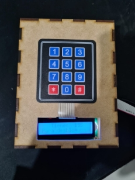

**Figura 1**. Ensamble total del proyecto.

**DESARROLLO DEL CODIGO**

Inicialmente creamos el proyecto LCD\_1, usamos el lenguaje VHDL porque para nuestro proyecto fue más sencillo de implementar y la FPGA era compatible. Para la conexión del sistema de la pantalla, nos ayudamos de una librería que se llamaba Librería LCD 16x2 y para el teclado nos apoyamos en la Librería Teclado Matricial 4x4. Usando estas librerías se establecen los puentes de conexión primario, que se refiere a establecer los pulsos.  Por ejemplo, en el caso de la pantalla LED se envían 8 bits, los dos primeros son de verificación y los siguientes seis son del envió de datos.

Una vez que se tienen todas las cosas conectadas y ya probadas, empezamos a generar código que es básicamente desarrollo de procesos o módulos.

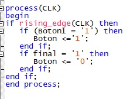

**Imagen 1.** Código correspondiente al primer modulo.

**Modulo 1.** Consiste en hacer que la placa sea sensible al CLK, es decir cuando detecte un cambio en el reloj de flanco de subida inicie, la variable botón es el accionador de todo el programa, cuando este toma el valor de 1, todo el programa se inicia, se encienden las matrices y los teclados. Para que este se encienda es necesario que botón1 = 1, que corresponde a nuestro sensor de vibraciones, que en la vida real indicaría que la bicicleta se encuentra en movimiento, activando el programa de Alarma.

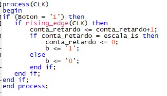

**Imagen 2.** Código correspondiente al segundo módulo.

**Modulo 2.** Contador interno cuenta los segundos, sabemos que el reloj interno de la FPGA son 50 MHz, es decir 50 millones de pulsos por segundos, entonces la variable b es sensible a los pulsos de la FPGA y cuanto ella llegue al límite cambiara de valor. 

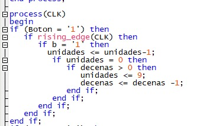

**Imagen 3.** Código correspondiente al contador 15 segundos.

**Modulo 3.** Contador de 15 que resta de uno en uno las variables, que se debe demorar el usuario en ingresar la contraseñas, en el código instanciamos decenas como 1, unidades como 5 y el empieza restando. Cuando llegue a cero enviara una señal de que se ha completado el tiempo.

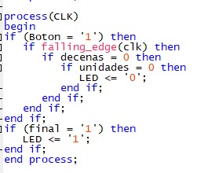

**Imagen 4.** Código correspondiente al comparador para iniciar alarma.

**Modulo 4.** Aquí se ingresa al módulo 3, para consultar los valores de decenas y unidades en cada periodo del reloj, cuando ambos valores se hacen cero, se envía una señal al Zumbador de que se active, el Zumbador quedo instanciado como la variable LED. 

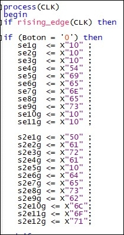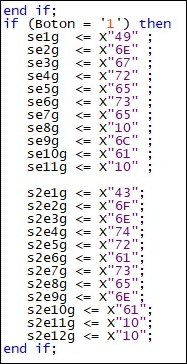

**Imagen 5.** Código correspondiente al módulo 5 y 6 respectivamente.

**Modulo 5 y 6.** Se encargan de mostrar la pantalla Antes y después. En el primer módulo se explica al usuario que tiene 15 segundos para escribir la contraseña, esto se muestra en la pantalla y en el segundo es donde se muestra que ingrese la contraseña, ambas dependen de la variable botón. Los caracteres están en código ASCII en representación hexadecimal, que la pantalla acepta. 

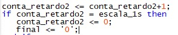

**Imagen 6.** Contador de reinicio del programa.

**Modulo 7.** Contador que reestablece las variables a un valor nominal, el contador espera un segundo después de que la variable final sea 1, la convierte en 0, esto para que el programa pueda volver a iniciar.

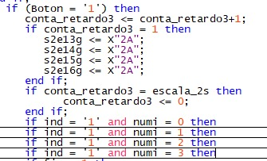

**Imagen 7.** Modulo 8. Código que muestra asteriscos sobre la pantalla.

**Modulo 8.** Este módulo también depende de la variable botón, ya que es nuestro accionador, lo que se hace es presentar en la pantalla 4 caracteres que son asteriscos, espere 15 segundos y seguidamente vuelva a convertirlos en asteriscos, esto ya que, si no se hiciera, al volver a iniciar el programa dejaría los números ingresados. También ahí mismo, antes de que se cumplan esos 15 segundos, se verifica el índice en donde se escribirán los números ingresados para que coincidan con los asteriscos, numi nos habla del espacio que coincide con ese índice. El índice 0 equivale a la celda numero 13 de nuestro LCD. En este módulo solo se muestra en pantalla la contraseña.

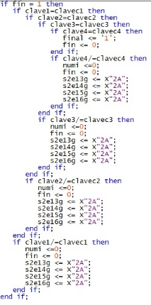

**Imagen 8.** Código del Módulo 9 que verifica que la clave sea correcta.

**Modulo 9.** En este módulo es una especie de bucle, pues se verifica que la contraseña sea correcta, los valores guardados son clavec1, clavec2, clavec3, clavec4 y los ingresados por el usuario son clave1, clave2, clave3, clave4, al concluir que la clave ingresada coincide lo que se hace es darles el valor a las variables de fin=0, final =1. La variable final deja el Botón en cero y deja el programa en pausa.  

Pero si por el contrario no coinciden las contraseñas, lo que hace es reiniciar el contador de numi, para que el usuario vuelva ingresar la contraseña desde el primer espacio de los 4 espacios que tiene la contraseña. Todas las veces que el usuario ingrese la clave y sea incorrecta, se mantendrá en este bucle, solo pudiendo ingresar si la contraseña es correcta.

**Imagen 9.**  Código del Módulo 10 se encarga de reiniciar variables de fin y camb. 

**Modulo 10.** Este módulo se encarga de que la variable final sea cero, para que el programa no se termine mientras se pone la clave y a su vez, cuando la clave sea correcta, regrese el valor de final que estaba en 1 a cero.

A continuación, se presentan las variables instanciadas que en este caso son señales, pues son las que conectan los módulos, esto debido a que, si un módulo le está ingresando un valor, solo ese modulo puede cambiar esa señal.

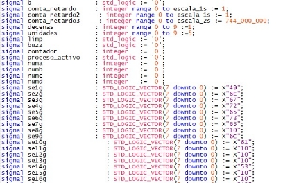

**Imagen 10.**  Señales o variables usadas en el programa.

**DIAGRAMA RTL**

Para una mejor visualización del diagrama dirigirse a la imagen correspondiente.

**DIAGRAMAS ASM**

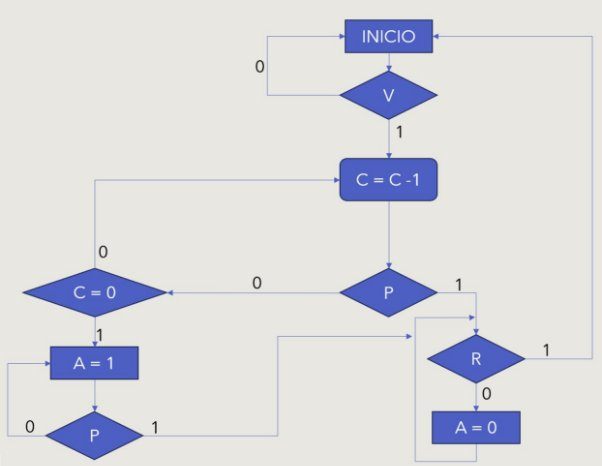

- P es Password
- A es alarma
- R es un mecanismo de Reset que pone el sistema como al comienzo.
- C es un contador regresivo que permite ingresar la contraseña en un tiempo determinado.

**CONSIDERACIONES ADICIONALES**

El teclado tiene un problema, el cual es el efecto rebote de las señales, que es básicamente que los valores quedan oscilando y generan ruido en las celdas, pusimos 4 resistencias, 1 en cada una de las filas para evitarlo. 

La FPGA cuenta con el Zumbador, que es el ruido y también tiene un potenciómetro conectado a la pantalla, entonces podemos ajustar el brillo. 

**CONCLUSIONES**

- El tamaño del dispositivo en la caja del prototipo corresponde al tamaño de la FPGA por lo que se puede reducir el tamaño aún más para la aplicación deseada implementando únicamente los componentes necesarios. 
- Debido a la naturaleza motriz del vehículo en el que se va a implementar el dispositivo se podría integrar un mecanismo de carga por inducción mediante un dinamo conectado a las ruedas de la bicicleta.
- Al evaluar la FPGA de CYCLONE IV ALTERA y la de ICE40, se determina que usar la CYCLONE IV ofrece mejores alternativas, pues viene con algunos periféricos de salida como el Zumbador que usamos en el proyecto, algo con lo que la ICE40 no cuenta.
- Resulta mucho más fácil programar en VHDL ya que está diseñado para admitir una jerarquía de diseño más completa. Puedes describir módulos y submódulos de manera más natural.

` `**REFERENCIAS**

[1]<https://www.movilidadbogota.gov.co/web/plan_bic>

[2]<https://www.infobae.com/america/colombia/2020/11/29/las-cifras-alrededor-del-robo-de-bicicletas-reflejan-que-a-bogota-se-le-salio-de-las-manos-la-situacion/>  

[3]<https://www.eltiempo.com/robo-de-bicicletas-en-bogota-tipos-de-robos-de-bicicletas-y-como-evitarlos-552002>

[4]<https://www.eltiempo.com/bogota/como-asegurar-y-parquear-bien-una-bicicleta-509252> 

[5]<https://www.dane.gov.co/files/investigaciones/poblacion/convivencia/2021/Bol_ECSC_2021.pdf> 

[6]<https://www.eltiempo.com/datos/robo-de-bicicletas-en-bogota-disminuyo-en-octubre-718143#:~:text=Para%20el%202022%2C%20la%20Secretar%C3%ADa,alrededor%20de%20una%20cada%20hora>.

[7]*INFORME BALANCE HURTO DE BICICLETAS SEGUNDO TRIMESTRE DE 2022 - OAIEE*

<https://scj.gov.co/sites/default/files/informe%20hurto%20a%20bicis%20segundo%20semestre%202022.pdf>

[8] <https://registrobicibogota.movilidadbogota.gov.co/#!/>

[9] *DIAGNÓSTICO PARA LA POLÍTICA PÚBLICA DE LA BICICLETA, [https://www.sdp.gov.co/sites/default/files/documento_diganostico_poltica_pblica_de_la_bicicleta.pdf*](https://www.sdp.gov.co/sites/default/files/documento_diganostico_poltica_pblica_de_la_bicicleta.pdf)*

[10]<https://bogotacomovamos.org/seguridad-para-los-biciusuarios/>

[11]*Si cambia el carro por bicicleta dejará de emitir 8 kilos de CO2 cada día*

<https://www.semana.com/impacto/articulo/cuanto-deja-de-contaminar-una-persona-que-cambia-el-carro-por-la-bicicleta/56234/>

[12] *Proyecto de Acuerdo 338 de 2020 Concejo de Bogotá, D.C.*

` `https://www.alcaldiabogota.gov.co/sisjur/normas/Norma1.jsp?i=142299

[13] *En Bosa aumenta la recuperación de bicicletas robadas en un 179%*

<http://www.bosa.gov.co/noticias/bosa-aumenta-la-recuperacion-bicicletas-robadas-179>

[14] *Sistema Electromecánico Para Evitar El Hurto De Bicicletas Bajo La Modalidad De Atraco En La Ciudad de Bogotá, <https://repository.udistrital.edu.co/bitstream/handle/11349/29054/EdwardTorresIvanAcero2021.pdf?sequence=1>*

[15] Security Chip Universidad Piloto 

<http://repository.unipiloto.edu.co/bitstream/handle/20.500.12277/6389/Security%20chip.pdf?sequence=1&isAllowed=y>

[16] *TROYA Sistema de seguridad para bicicletas*

[*https://repository.javeriana.edu.co/bitstream/handle/10554/20859/PolancoCeronOsacarDaniel2016.pdf?sequence=1&isAllowed=y*](https://repository.javeriana.edu.co/bitstream/handle/10554/20859/PolancoCeronOsacarDaniel2016.pdf?sequence=1&isAllowed=y)

